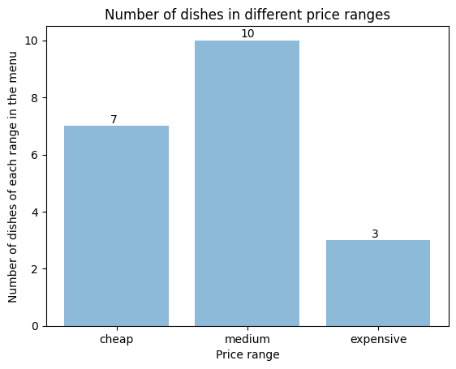
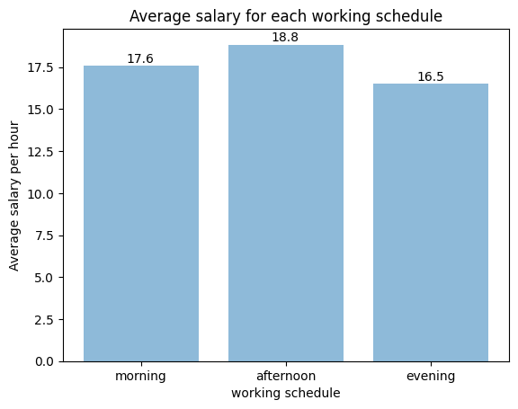

# Deliverable 3 (Group 62)

[TOC]

## Q1: Stored procedure

### Description: 

This function (Procedure) will train all the chef (i.e. increase the proficiency of the chef by one) below the function input `max_proficiency`. The function will take one input which is `max_proficiency`. All the chef with proficiency less than or equal to this `max_proficiency` will be trained. 

> Handling constraints: Since the proficiency of the chef is between 0 and 5, if the input `max_proficiency` is out of this range, no chef will be trained (i.e. the database remains unchanged)

### Procedure:

```sql
CREATE OR REPLACE FUNCTION train_all_the_chef(max_proficiency INTEGER)
RETURNS VOID AS $$
DECLARE
    rec_chef RECORD;
    cur_chefs CURSOR(max_proficiency INTEGER)
       FOR SELECT sid, proficiency 
       FROM chef
       WHERE proficiency <= max_proficiency;
BEGIN
   -- Open the cursor
    OPEN cur_chefs(max_proficiency);
 
	IF max_proficiency > 4 THEN
		RETURN;
	END IF;
	
    LOOP
        FETCH cur_chefs INTO rec_chef;
        EXIT WHEN NOT FOUND;
	UPDATE chef SET proficiency = proficiency + 1 WHERE sid = rec_chef.sid;
    END LOOP;
	
    -- Close the cursor
    CLOSE cur_chefs;
END;
$$ LANGUAGE plpgsql;


SELECT sid, proficiency FROM chef 

UPDATE chef 
SET proficiency = 2
WHERE sid = 13

SELECT FROM train_all_the_chef(3)
```

### Example (Test with valid input)

- Query before execution
  - We want to train all the chef with proficiency less than or equal to 3

```
cs421=> SELECT sid, proficiency FROM chef ORDER BY sid;
 sid | proficiency
-----+-------------
  13 |           2
  14 |           3
  15 |           3
  16 |           3
  17 |           4
  18 |           5
(6 rows)
```

- Execution of the procedure (Nothing is returned because the return type is void)

```
cs421=> SELECT FROM train_all_the_chef(3);
--
(1 row)
```

- Query after execution

```
cs421=> SELECT sid, proficiency FROM chef ORDER BY sid;
 sid | proficiency
-----+-------------
  13 |           3    <-- after training (increased by 1)
  14 |           4    <-- after training (increased by 1)
  15 |           4    <-- after training (increased by 1)
  16 |           4    <-- after training (increased by 1)
  17 |           4
  18 |           5
(6 rows)
```

### Example (Test with invalid input)

- Query before execution
  - We want to train all the chef with proficiency less than or equal to 6 (which is not a valid execution)
  - The expectation is that the table remains **unchanged**

```
cs421=> SELECT sid, proficiency FROM chef ORDER BY sid;
 sid | proficiency
-----+-------------
  13 |           2    <-- stay the same
  14 |           3    <-- stay the same
  15 |           3    <-- stay the same
  16 |           3    <-- stay the same
  17 |           4    <-- stay the same
  18 |           5    <-- stay the same
(6 rows)
```

- Execution of the procedure (Nothing is returned because the return type is void)

```
cs421=> SELECT FROM train_all_the_chef(6);
--
(1 row)
```

- Query after execution

```
cs421=> SELECT sid, proficiency FROM chef ORDER BY sid;
 sid | proficiency
-----+-------------
  13 |           2    <-- stay the same
  14 |           3    <-- stay the same
  15 |           3    <-- stay the same
  16 |           3    <-- stay the same
  17 |           4    <-- stay the same
  18 |           5    <-- stay the same
(6 rows)
```


---


## Q4: Visualization

We used Jupyter Notebook for this part of the deliverable. The matplotlib library in Python is used to plot the bar chart.

[View our code and result graph on Google CoLab.](https://colab.research.google.com/drive/1N3ck6t2Ib-MlFnOCvvYOw3uwPriWEtpU)

### Visualization 1: Number of dishes in different price range

- We could show the number of dishes in different price ranges
- The definition of price range is:

| price range      | result    |
| :--------------- | :-------- |
| 0 < price < 20   | cheap     |
| 20 <= price < 40 | medium    |
| price > 40       | expensive |

- original data gathered by running the sql command and export table as `dish.csv`

```
cs421=> SELECT * FROM dish;
              dish_name              | price
-------------------------------------+--------
 Sautéed Dark Beer Pork              |   28.9
 Simmered Peas & Mushroom Oysters    |   66.6
 Breaded Cucumber & Lime Pizza       |   19.9
 Roasted Almonds & Avocado Bread     |   28.9
 Rum and Praline Delight             |   17.9
 Chestnut and Nutmeg Gingerbread     |   25.9
 Ginger Candy                        |   5.99
 Cranberry Genoise                   |     27
 Fire-Roasted Basil & Mint Yak       |   32.3
 Simmered Mountain Rabbit            |   22.5
 Pressure-Fried Vegetables & Frog    |   31.5
 Sautéed Orange & Mustard Vegetables |   26.9
 Barbecued Mustard & Garlic Calzone  |     25
 boiled spicy fish                   |  30.99
 Guoyou pork                         |  17.99
 Sweet and sour pork ribs            |   14.5
 beef pho                            |   10.5
 General Tsos Chicken                |   15.5
 Tenderized Truffles & Yak           | 56.089
 Tenderized Parmesan Lobster         | 109.89
(20 rows)
```

- code in Jupyter Notebook

```python
import csv
price_range = {"cheap": 0, "medium": 0, "expensive": 0}
with open('dish.csv', newline='') as csvfile:
  reader = csv.DictReader(csvfile)
  for row in reader:
    price = float(row['price'])
    if price < 20:
      price_range["cheap"] += 1
    elif price < 40:
      price_range["medium"] += 1
    else:
      price_range["expensive"] += 1

import numpy as np
import matplotlib.pyplot as plt

ranges = price_range.keys()
y_pos = np.arange(len(ranges))
number = price_range.values()

plt.bar(y_pos, number, align='center', alpha=0.5)
plt.xticks(y_pos, ranges)
plt.ylabel('Number of dishes of each range in the menu')
plt.xlabel('Price range')
plt.title('Number of dishes in different price ranges')

for i, v in enumerate(number):
  plt.text(i - 0.05, v + 0.1, str(v))

plt.show()
```

- result image:



### Visualization 2: Average salary of each working schedule

- We could show the average salary of each working schedule
- Average salary is calculated based on following formulas:

| Schedule  | avg_salary                                      |
| :-------- | :---------------------------------------------- |
| morning   | sum_salary['morning']/num_people['morning']     |
| afternoon | sum_salary['afternoon']/num_people['afternoon'] |
| evening   | sum_salary['evening']/num_people['evening']     |

- original data gathered by running the sql command and export table as `staff.csv`

```
cs421=> SELECT * FROM staff ORDER BY sid;
 sid |      sname       | working_schdule | salary
-----+------------------+-----------------+--------
   1 | Samuel Randall   | morning         |     21
   2 | Shala Tang       | morning         |     19
   3 | Macie Finely     | afternoon       |     21
   4 | Jeffrey Frye     | afternoon       |     12
   5 | Anna Black       | evening         |     21
   6 | Hugo Turner      | evening         |     12
   7 | Annie Carr       | evening         |     13
   8 | Cara Allenr      | morning         |     19
   9 | Jodie Stuart     | afternoon       |     19
  10 | Cassie Noble     | afternoon       |     21
  11 | Lachlan Lawrence | evening         |     19
  12 | Ammie Summers    | evening         |     13
  13 | Lacie Barr       | morning         |     16
  14 | Isla Greer       | morning         |     16
  15 | Meadow Moran     | afternoon       |     21
  16 | Steve Marwan     | afternoon       |     19
  17 | Luis Nash        | evening         |     21
  18 | Melanie Hill     | morning         |     19
  19 | leo              | morning         |     13
(19 rows)
```

- code in Jupyter Notebook

```python
import csv
num_people = {"morning": 0, "afternoon": 0, "evening": 0}
sum_salary = {"morning": 0, "afternoon": 0, "evening": 0}
with open('staff.csv', newline='') as csvfile:
  reader = csv.DictReader(csvfile)
  for row in reader:
    time = row['working_schdule']
    if time == 'morning':
      num_people['morning'] += 1
      sum_salary['morning'] += float(row['salary'])
    elif time == 'afternoon':
      num_people['afternoon'] += 1
      sum_salary['afternoon'] += float(row['salary'])
    else:
      num_people['evening'] += 1
      sum_salary['evening'] += float(row['salary'])
avg_salary = {"morning": sum_salary['morning']/num_people['morning'], 
              "afternoon": sum_salary['afternoon']/num_people['afternoon'], 
              "evening": sum_salary['evening']/num_people['evening']}

import numpy as np
import matplotlib.pyplot as plt

slot = avg_salary.keys()
y_pos = np.arange(len(slot))
number = avg_salary.values()

plt.bar(y_pos, number, align='center', alpha=0.5)
plt.xticks(y_pos, slot)
plt.ylabel('Average salary per hour')
plt.xlabel('working schedule')
plt.title('Average salary for each working schedule')

for i, v in enumerate(number):
  plt.text(i - 0.1, v + 0.2, str(round(v, 1)))

plt.show()
```

- result image:

